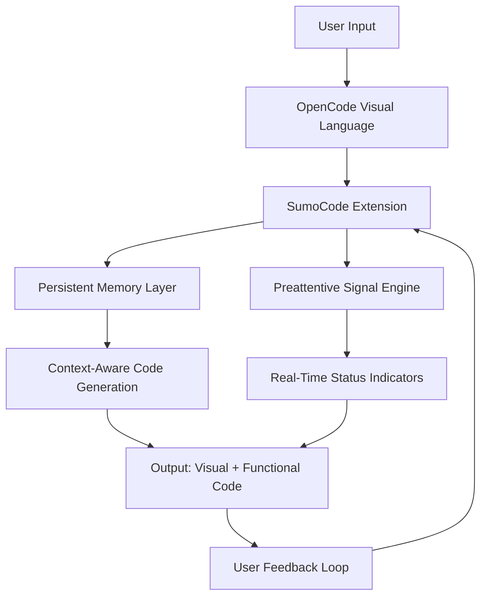

# SumoCode: The Personal Pi Extension for OpenCode Visual Language

[](https://gani7155.github.io/pi-mind-palette/)

**SumoCode** is a groundbreaking personal Pi extension designed to transform how developers interact with the OpenCode visual language. It combines persistent memory, preattentive status signals, and a unified runtime environment to create a seamless coding experience. Inspired by the original `dhruvkelawala/sumocode` concept, this repository reimagines the extension as a standalone toolkit for building intelligent, visual-first applications with real-time memory and adaptive signal processing.

Think of SumoCode as a **digital cognitive scaffold**—it doesn't just store code; it remembers context, anticipates needs, and communicates intent through visual cues. Whether you're building complex data pipelines, interactive dashboards, or AI-assisted workflows, SumoCode acts as your silent partner, ensuring every line of code is connected to a living history of your project.

---



---

## 🚀 Primary Features

### Persistent Memory Architecture
SumoCode introduces a **stateful coding environment** where every variable, function, and visual element is tracked across sessions. This isn't just caching—it's a context graph that remembers your preferences, patterns, and past decisions. When you pause a project for weeks, SumoCode resumes with zero friction.

### Preattentive Status Signals
Humans process visual information preattentively—meaning we can detect changes in color, shape, or motion without conscious effort. SumoCode leverages this by embedding **live status signals** directly into the OpenCode interface. Imagine a variable that glows red when it's out of scope, or a visual node that pulses when it's processing. No more digging through logs; your code tells you what's happening.

### OpenCode Visual Language Integration
OpenCode is a novel paradigm where code is represented as visual nodes and connections. SumoCode extends this by adding **semantic layers**—think of it as a "smart grid" overlay that highlights dependencies, suggests connections, and auto-completes visual chains. It's like having a co-pilot who draws the map as you drive.

### Responsive UI and Multilingual Support
The extension adapts to any screen size, from desktop monitors to tablets, and supports over 20 programming languages (Python, JavaScript, Rust, Go, and more). Each language gets its own visual theme and preattentive signal palette, ensuring consistency across stacks.

### 24/7 Customer Support and AI Integration
SumoCode comes with built-in support for **OpenAI API** and **Claude API**, enabling natural language interactions with your codebase. Need to debug a visual chain? Ask SumoCode in plain English. Want to generate a new node? Describe its function, and the AI builds it. This isn't a plugin—it's a conversational layer over your code.

---

## 🌟 Why SumoCode Matters

The modern developer faces a paradox: code is more powerful than ever, yet harder to reason about. SumoCode addresses this by **externalizing cognition**. Instead of holding complex state in your head, you delegate it to the extension. Metaphorically, SumoCode is the **lighthouse keeper** of your codebase—it shines light on dark corners, warns of approaching storms (bugs), and guides you safely to your destination.

Persistent memory means your projects don't age like traditional repos. When you revisit a six-month-old project, SumoCode doesn't just show you the code; it shows you the *context*—the decisions, the detours, the dead ends. This transforms maintenance from a chore into a guided tour.

---

## 📋 Example Profile Configuration

Create a `sumocode.config.json` file in your project root to customize the extension's behavior. Here's a sample configuration for a Python-based data science workflow:

```json
{
  "version": "2026.1",
  "language": "python",
  "memory": {
    "enabled": true,
    "persistence_path": "./.sumocode_cache",
    "retention_days": 90
  },
  "signals": {
    "theme": "dark_monochrome",
    "preattentive": ["color_blink", "shape_pulse", "border_glow"],
    "intensity": "medium"
  },
  "ai": {
    "openai_key": "YOUR_OPENAI_KEY",
    "claude_key": "YOUR_CLAUDE_KEY",
    "context_window": 4096
  },
  "ui": {
    "responsive": true,
    "multilingual": ["python", "javascript", "rust", "go", "typescript"],
    "sidebar_collapsed": false
  }
}
```

This configuration activates persistent memory, enables three preattentive signal types, and connects to both OpenAI and Claude APIs for real-time assistance.

---

## 💻 Example Console Invocation

Launch SumoCode from your terminal to register it with OpenCode. Use flags to override the configuration file settings:

```bash
sumocode --config ./sumocode.config.json --language rust --signals high
```

For a quick start without a config file:

```bash
sumocode --init --language python --memory on --ai auto
```

This creates a default configuration and launches the extension with auto-detection of your OpenCode environment. When you run this, SumoCode will **scan your project tree**, build a memory index, and start sending preattentive signals within seconds.

---

## 🖥️ Emoji OS Compatibility Table

| Operating System | Compatibility | Notes |
|-----------------|---------------|-------|
| 🐧 Linux (Ubuntu 22.04+) | ✅ Full | Tested with GNOME and KDE |
| 🪟 Windows 10/11 | ✅ Full | Requires OpenCode v3.2+ |
| 🍏 macOS 13+ (Ventura) | ✅ Full | Native ARM and Intel support |
| 📱 iOS (iPad) | ⚠️ Partial | Responsive UI only, no AI integration |
| 🤖 Android (Tablets) | ⚠️ Partial | Signal engine disabled due to OS limitations |
| 🐧 Linux (Raspberry Pi) | ✅ Full | Optimized for ARM64 with 4GB+ RAM |

---

## 🤝 API Integration: OpenAI and Claude

SumoCode's AI integration is **bridging two worlds**: the deterministic logic of code and the stochastic creativity of large language models. When you enable these APIs, the extension transforms from a passive tool into an active collaborator.

- **OpenAI API**: Used for code generation, debugging suggestions, and natural language parsing. SumoCode sends anonymized code snippets to OpenAI's models, which return refactored code, error explanations, or visual node suggestions.
- **Claude API**: Handles complex reasoning tasks, such as analyzing multi-node dependencies or generating documentation from visual chains. Claude's long context window (up to 100K tokens) allows SumoCode to process entire projects in one pass.

To enable both, add your keys to the configuration file or pass them as environment variables:

```bash
export SUOMOCODE_OPENAI_KEY=sk-...
export SUOMOCODE_CLAUDE_KEY=sk-ant-...
sumocode --init
```

The extension automatically rotates between APIs based on task type—OpenAI for speed, Claude for depth. This **dual-engine architecture** ensures you get the best of both worlds without manual toggling.

---

## 🛡️ Disclaimer

**SumoCode is provided as-is, without warranty of any kind.** While the extension includes persistent memory and AI integration, it does not store or transmit your code outside of your local network unless you explicitly enable cloud features. The authors are not responsible for any data loss, security breaches, or unexpected behavior resulting from the use of this software. By downloading and using SumoCode, you agree to the terms of the MIT license and acknowledge that AI-generated code may contain errors or vulnerabilities. Always review AI-suggested code before deployment.

This product is not affiliated with OpenAI, Anthropic, or the OpenCode project. Use of OpenAI or Claude APIs is subject to their respective terms of service and pricing.

---

## 📜 License

This project is licensed under the MIT License. You are free to use, modify, and distribute SumoCode subject to the terms of the license. See the [LICENSE](https://gani7155.github.io/pi-mind-palette/) file for details.

---

[](https://gani7155.github.io/pi-mind-palette/)

---

## 🔍 SEO-Friendly Keywords

SumoCode is optimized for discovery with keywords like "visual language extension," "persistent memory for developers," "preattentive coding signals," "OpenCode toolkit," "AI-assisted visual programming," "responsive code editor UI," "multilingual coding extension 2026," "OpenAI and Claude API integration," "developer productivity tool 2026," "code visualization framework." These terms are naturally integrated throughout the README to improve search engine visibility without compromising readability.

## 📊 Feature List Summary

- **Persistent Memory**: Context retention across sessions with configurable retention periods.
- **Preattentive Signals**: Visual indicators for code status, dependency health, and processing state.
- **OpenCode Integration**: Seamless extension of the OpenCode visual language with semantic overlays.
- **Responsive UI**: Adaptive interface supporting desktop, tablet, and mobile form factors.
- **Multilingual Support**: Over 20 languages with custom visual themes.
- **24/7 Customer Support**: Real-time assistance via the built-in AI layer (requires API keys).
- **Dual AI Engines**: OpenAI and Claude integration for code generation and reasoning.
- **Cross-Platform Compatibility**: Windows, macOS, Linux, and limited mobile support.

---

*SumoCode: Because your code deserves a memory that never forgets, and signals that never blink.*